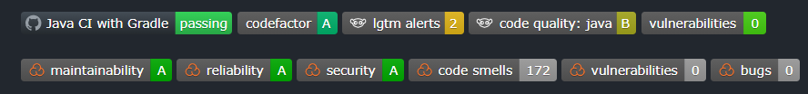

# External websites for reviews

[Go back](../index.md#advanced-concepts)

This is my list of websites that I heard of and used for most of them. You can log in using your GitHub account, and make them review your code (usually, it's free for an open-source project, paid for others).

* [sonarcloud](https://sonarcloud.io) (the **BEST**, quite a lot of feedback)
* [codefactor](https://www.codefactor.io/) (analysis, good)
* [deepsource](https://deepsource.io/) (seems good, but no issues were found in my project 😐)
* [codetriage](https://www.codetriage.com/) (get issues in your inbox)
* [codecov](https://about.codecov.io/) (code coverage)
* [weblate](https://weblate.org/fr/) (not used)
* [snyk](https://snyk.io/) (vulnerabilities, **good**)
* [codacy](https://www.codacy.com/) (I didn't manage to install this one)
* [lgtm](https://lgtm.com/) (basic feedback)
* [scrutinizer-ci](https://scrutinizer-ci.com/) (paid only, not tested)
* [deps.rs](https://deps.rs/) (Rust dependencies alerts)

> **BUT** it's tiring to check each website if they got news? or How is it automated?

Well, you will usually put a badge in your README (as explained in [Make Git project](../../../proj/make-git-project/index.md)), and the badge will be updated each time someone goes to the page (=each time the badge is rendered), so you will see inside if you have to go check the website or not.

Some websites can also **make comments in your Pull requests**, if you enabled it, or sometimes if you have the paid version (Sonar cloud, LGTM, and Snyk did it for free for me).

