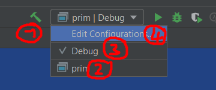

# CMake

[Go back](../index.md#clion)

Create a `CmakeLists.txt` if not already created. This is a bit harder to use than a Makefile, but most of the time, you won't have to do something complicated. A CMake file is generating an unreadable Makefile inside the build folder.

```cmake
cmake_minimum_required(VERSION 3.16.3) # or 17 / your version
project(nom_projet C) # project name
set(CMAKE_C_STANDARD 99) # standard

# create a target with a name
# and add all the files
add_executable(name main.c main.h ...)
```

If the name is `prim` then after compiling your CMakelist you will have here



and you can

1. compile
2. select this target as the compiled one/run one
3. change the profile
4. run this target

(A profile is a configuration. You may use these if you want to try to build/run using different configurations, but that should not be the case most of the time).

<hr class="sl">

## Using pthread.h

<https://stackoverflow.com/questions/1620918/cmake-and-libpthread>

```cmake
set(THREADS_PREFER_PTHREAD_FLAG ON)
find_package(Threads REQUIRED)
target_link_libraries(my_app PRIVATE Threads::Threads)
```

<hr class="sr">

## Using math.h

```cmake
target_link_libraries(my_app PRIVATE m)
```

<hr class="sl">

## Include a folder of *.h

```cmake
include_directories(path/to/folder)
```