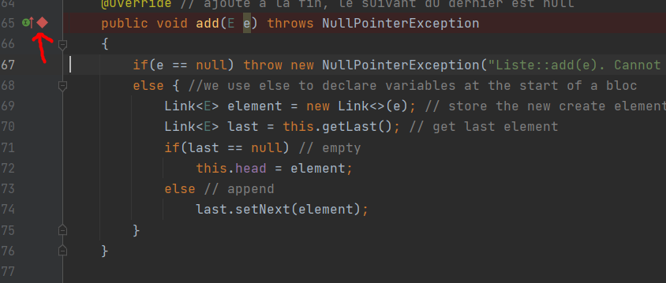
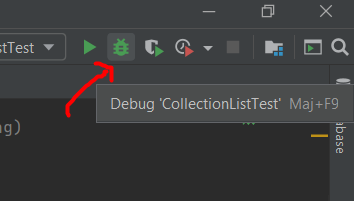
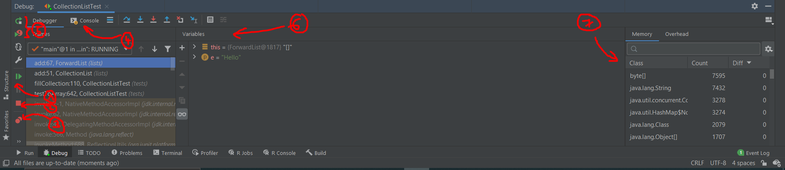

# Debug

[Go back](..#clion)

In the left column, you can place breakpoints.

Then run your program in debug mode.

And you will see this great tool

1. go to the next breakpoint
2. stop
3. breakpoint list
4. console/terminal
5. restart debug
6. check variables
7. files/classes in memory