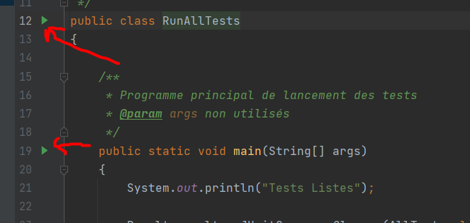
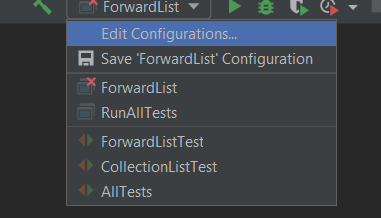
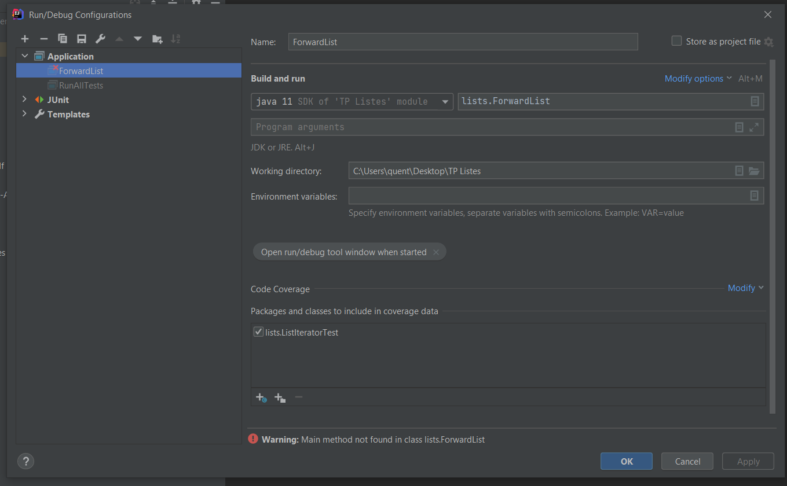

# Run

[Go back](..)

To run some class, simply go to the ``main``
function then you should see a ``green`` arrow. Click
on it and that's it.

If you don't see such a thing or may want to tune a bit
the launch of your main, then open ``edit configurations``
menu.

then you can set your JDK, your program argument
and even set VM options.

## I don't have an arrow

Check if your JDK is set. If that's okay, then
is the directory of your files in ``blue``?

If not then ``CTRL+ALT+MAJ+S`` then go to `modules`
then set your source folder as ``source``.

