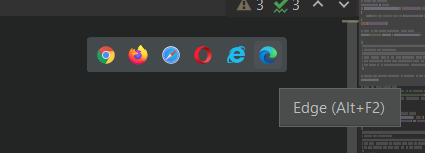
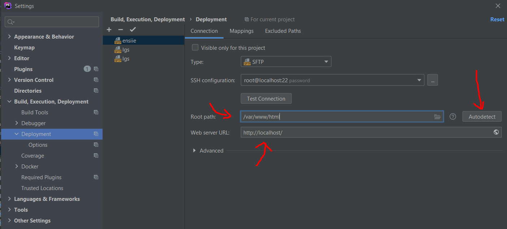

# Launch website

[Go back](..#phpstorm)

Open an ``HTML`` or `PHP` file. Then you should
see those

but they may not open the URL you wanted.

If that is the case, simply open ``Deployment`` menu
(shift+shift > Deployment > configuration on 2021+)

and change the webserver URL. You may also change the
root path or go into ``mappings`` and make some changes
here.