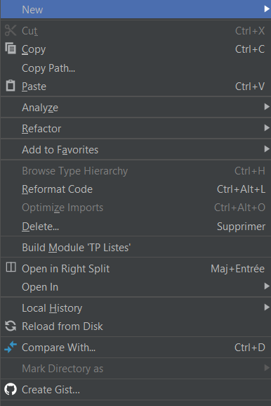

# Context menu on file list

[Go back](interface.md)

This was the menu we add in 2020.3, [need update].

* `new` to create a new file, with a template
* `analyze` : [see analyze menu](menus/analyze.md)
* `refactor`: rename, ... [see refactor](menus/refactor.md).
* you can also delete a file with your delete key
* `reformat code`: cleanup code
* `open in`: open in terminal, explorer
* `git`: undo, revert, ...
* `local history`: undo, revert, ...
* `Mark directory`: mark as root, sources, tests, ... directory