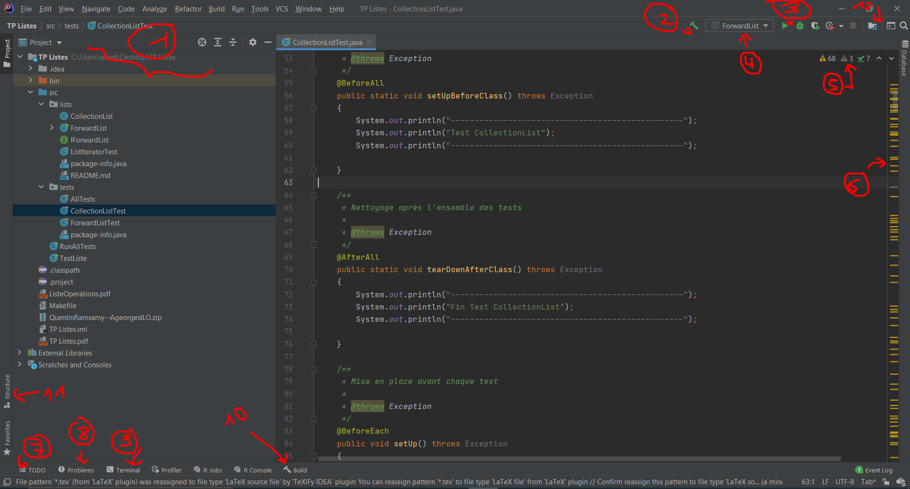

# Interface

[Go back](..#interface-presentation)

Your interface should look a bit like this, at least based on IntelliJ2020 (it changed a bit in 2021)

1. list of your files, [context menu](context.md)
2. compile but do not run
3. choose what we will compile (target)
4. compile and start
5. number of warnings, errors, ...
6. check where are your warnings, errors, ...
7. list of ``todo``
8. complete and readable list of your warnings, ...
9. terminal
10. build messages
11. file structure
12. project structure (JDK, Modules, ... in JAVA)