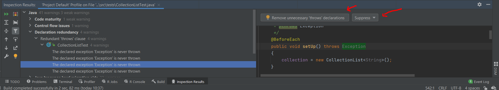

# Analyze

[Go back](../menus.md)

Analyze your code and tells you how to write something
better.

Right-click on a file or a folder, then ``inspect code``.

You will have a list of your potential amelioration.
You may as well suppress false warnings here.

