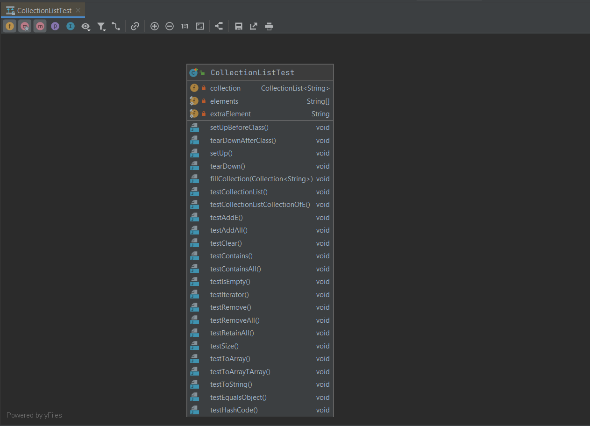

# UML

[Go back](../menus.md)

Remember theses shortcuts

* ``CTRL+ALT+MAJ+U``
* ``CTRL+ALT+U``

They work at least in ``JAVA``, `PHP` and `JS`.

You will have something like this in Java. Be sure
to select all files that you want in the diagram. You
can add or remove part of it later such as attributes,
classes, or methods...

