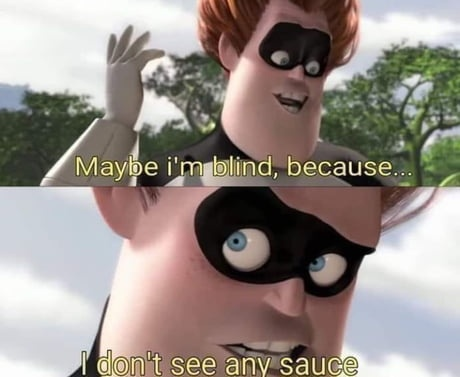

# Images

[Go back](..)

A bunch of tools, to create/edit images, to resize and convert them. There are also tools to find the "sauce" of a manga or handling GIFs.

## Tools

When dealing with images, you may want

* **create/edit**
  * to remove the background (<https://www.experte.com/background-remover> or maybe <https://www.remove.bg/>)
  * to make/split/crop/... a GIF/a normal image (<https://ezgif.com/>)
* **resize**
  * resize a lot of images (<https://picresize.com/>)
  * resize one image (<https://www.resizepixel.com/>)
* **convert**
  * [avif](https://avif.io/) (need tool to convert and compress images, **no upload**)
  * a lot of JPGs to WebP (more than 10) <https://online-converting.com/image/>
  * a PNG to an SVG <https://png-svg.com/>
  * otherwise, enter "xxx to yyy" to look for a converter from xxx to yyy
* **reverse search**
  * [tineye](https://tineye.com/)
  * Google's search by image

## What's the sauce?

This website is supposed to help you find the sauce when someone is posting a chapter of a manga. It didn't work for me, but who knows, maybe for you, it will?

* <https://saucenao.com/>

## GIFs

You can make GIFs using

* <https://www.pixilart.com/draw> (you can make a handmade animation easily)
* <https://ezgif.com/> (you can do a lot of things, like compressing a GIF after creating one)