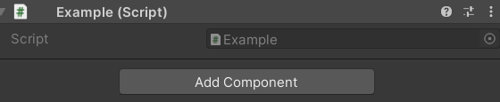
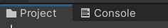
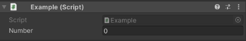
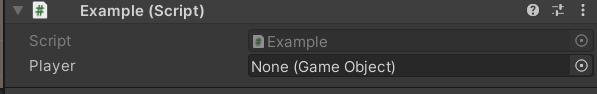
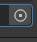
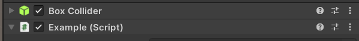
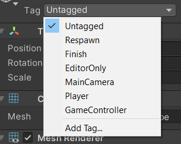

# Introduction

**I'm still learning Unity**, so this is only made by a beginner for beginners. Unity is a **game engine** that you can [download here](https://store.unity.com/#plans-individual).

* **unity hub**: software to manage unity versions and projects
* **unity**: downloaded through unity hub, **usually peoples are using LTS** <small>(Long-term support)</small> **versions** of unity because they will still receive patches (fix bugs, no new features) for 2 years, **so they are stable versions**.

<details class="details-e">
<summary>You may use the student plan (if you are a student)</summary>

* go to [Unity Student Plan](https://unity.com/products/unity-student)
* click on High school students
* Log in/Register
* Fill the form, powered by SheerID
* Send a pic of your student ID
* Done, wait a bit, you should receive a mail telling you **welcome** and **how to get started**
</details>

> ⚠️ A wise man/woman would regularly save his/her work ⚠️

<hr class="sl">

## What's a Game engine?

<div class="row">
<div class="col-md-4">


</div>
<div class="col-md-6">

I found this picture a while back on [envato-tuts+](https://gamedevelopment.tutsplus.com/). This is quite easy to understand that a **game engine** will deal for you about a lot of things related to the tech/hardware <small>(sound, io, graphics)</small> and let you focus on your game <small>(quests, inventory, levels, ...)</small>.

Unity is focused on providing support for multiples platforms <small>(Windows, Linux, Mac, Web, Android, iOS)</small>, so it's quite convenient.

The editor is written in **C++**, but the scripts (=your code) will be in **C#**.

Unity is providing generic support for your games, sometimes you may want more. You can add **plugins** for that. For instance, the [TopDownEngine](https://assetstore.unity.com/packages/templates/systems/topdown-engine-89636) (a **paid** asset) is providing a lot of help to create 2D/3D TopDownGames <small>(check "templates" on the unity store to see what you could expect from game templates, as you may save a lot of time with them)</small>.
</div>
</div>

In **Unity** everything, I mean everything (entities, light, images, etc.) is a **Game object**. I think that this is their own way of implementing  **architectural pattern** called **Entity-component-system** (ECS), but I'm unsure of it <small>(I'm still learning 😖)</small>.

<hr class="sl">

## Version-control in Unity

If you are **unfamiliar** with Github/Git, you may read the [GIT course](../git/index.md). Unfortunately, for a non-programmer, this may be complex, my advice is to [create a repository](https://docs.github.com/en/get-started/quickstart/create-a-repo) (ex: on GitHub) and skip everything else.

Unity projects are **made of a lot of files**, including **big files too**, so you can't commit (~=save) them. Fortunately, you to use Git LFS to transfer big files, and you got a plugin making things easy in unity.

* [GitHub for unity (tool/download)](https://unity.github.com/)
* [GitHub for unity (quick-guide)](https://github.com/github-for-unity/Unity/blob/master/docs/using/quick-guide.md)

<details class="details-e">
<summary>My tutorial</summary>

* download GitHub for unity (1st link)
* you got a ".package"
* open your project, and drag and drop it inside the **project window** (the file explorer, the bottom left panel)
* then click on "import" on the panel that opened
* then you can show the "Git tab" using <kbd>Window > GitHub</kbd>
* *you may have to install [GitHub LFS](https://git-lfs.github.com/)*
* *you may have to install [Git](https://git-scm.com/downloads)* (👀)
</details>

<hr class="sr">

## Interface

When you are opening a project, by default you got 4 windows.

* **hierarchy window** (left): list of all **GameObjects**
* **scene window** (middle): a scene is like a screen of your game (by default you are in the sample scene)
    * **Press run, to run your game**, you can make changes while the game is running, but they will be lost when the game is closed
    * you can click on the "game tab" to see your game running <small>(you can set the resolution here too)</small>
    * and go back to the "scene tab" to edit it (**don't forget to stop it**)
* **inspector window** (right): you can edit the properties of the selected **GameObject**
  * ex: click on a GameObject and change the position (Transform > Position)
  * ex: click on a GameObject and change the size (Transform > Scale)
  * ...
* **project window** (bottom): all of your project files

> Some shortcuts
> 
> * <kbd>F</kbd> in the hierarchy window, to focus a GameObject in the scene window

<hr class="sl">

## Be good, use folders!

The project files are usually split into folders, using these folders names

* **Animations**, **Audio**, **Cutscene**
* **Editor**, **Images**, **Materials**
* **Plugins**
* **Prefabs**: your prefabs, they are preconfigured objects like a player with a configuration. You can create one by dragging and dropping a GameObject in the project window
* **Scenes**: your scenes (unity scene files, a screen of your game)
* **Scripts**: your C# scripts (.cs)
* **Settings**, **Shaders**

<hr class="sr">

## Scripts

Scripts are in **C#**, an old version of C#. From [this page about the C# compiler](https://docs.unity3d.com/2020.3/Documentation/Manual/CSharpCompiler.html), Unity 2020.3 (LTS) is using **C# 8.0**. In **2021.2+**, they are using **C# 9.0**, but of course we are not using a non-LTS version. You should also note that even if they are using the version 8.0/9.0, **every feature of C# is not available** (check on page above, for "Unsupported features").

Right-click inside the **project window**, create a new Folder "Scripts" and a new script (ex: "Example.cs").

<div class="text-center">


</div>

<div class="row">
<div class="col-md-6">

```cs
using UnityEngine;

public class Example : MonoBehaviour
{
    // Awake is called when the script instance is being loaded
    private void Awake() { }

    // Start is called before the first frame update
    private void Start() { }

    // Update is called once per frame
    private void Update() { }
}
```
</div>
<div class="col-md-6">

### Explanations

After removing unused imports, I added the Awake function. This is a sample of the 3 functions you will use.

These scripts can be added to components, by **clicking on a component**, then using **"add component"** in the inspector window. Search your scripts by the name (ex: "Example") and add it.



Note that you can use the 3 vertical dot to remove a component, or easily open a script.

> If you are unsure about what's a method/class/attribute, you may read the Java course or watch some videos, as this would be a good practice to write better code 🚀.
</div>
</div>

> **Note**: In a Script, you can use `Debug.Log(something)` to print something in the editor, inside the console .<br>
> **Note**: In C#, you can use `var` instead of the type of a variable when creating a variable with a value, to ask the compiler to infer a type. This is a kind of lazy-practice 🙄.

<hr class="sl">

## User-friendly scripts

If you want, you may **add fields in the inspector** like you have for other sections, like "Number" here.



Either make the attribute **public** or add **[SerializeField]** before the attribute (recommended).

```cs
// Note: can be on two lines, or one
[SerializeField] private int number = 0;
// same as above :(, but this is "a side effect"
public int number = 0;
```

<details class="details-border">
<summary>Of course, you can make something look better by using ToolTips, Menus, Headers, Spaces, etc.</summary>

```cs
// you renamed something
[SerializeField]
[FormerlySerializedAs("OldName")] private int number = 0;

// make a class available in "folder/.../name" in the
// component selector
[AddComponentMenu("folder/class")]
// adding tooltips
[Tooltip("blah blah blah")]
// The following attributes will be inside this header
[Header("a header")]
// ...
// Spacing
[Space(value)]
```
</details>

<details class="details-border">
<summary>Note that you can easily link components using this</summary>
<br>

```cs
[SerializeField] private GameObject player;
```

Giving you



And you simply have to drag-and-drop a game object (ex: a player) from the **Hierarchy window** to this field. This is useful when you don't want to do tiring things (ex: using tags/...) to get another GameObject.

Note: you can use the small dot too , to see a list of GameComponent this field can take.
</details>

<hr class="sr">

## Game Objects in Scripts

After you attached a script to an entity, you can get other components in a script with `GetComponent<TypeOfComponent>`



```cs
// In Example.cs, I can get the BoxCollider with
BoxCollider collider = GetComponent<BoxCollider>();
```

You can also access some objects such as Transform or the tag with attributes ("this" is unneeded, check the documentation to learn more)

```cs
// set scale, ...
Transform _transform = this.transform;
// associated gameObject
GameObject o = this.gameObject;
// it's tag (<=> this.tag or tag)
string tag = this.gameObject.tag;
```

<details class="details-e">
<summary>Tags</summary>

<div class="row">
<div class="col-md-4">


</div>
<div class="col-md-8">

You can give tags to components in the editor. This is useful to get a component, or a bunch of components.

```cs
GameObject[] objects = GameObject.FindGameObjectsWithTag("TagName");
GameObject obj = GameObject.FindGameObjectWithTag("TagName");
```
</div>

</div>
</details>