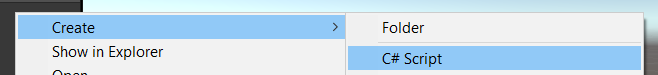

# Introduction

**I'm still learning Unity**, so this is only made by a beginner for beginners. Unity is a **game engine** that you can [download here](https://store.unity.com/#plans-individual).

* **unity hub**: software to manage unity versions and projects
* **unity**: downloaded through unity hub, **usually peoples are using LTS** <small>(Long-term support)</small> **versions** of unity because they will still receive patches (fix bugs, no new features) for 2 years, **so they are stable versions**.

<details class="details-e">
<summary>You may use the student plan (if you are a student)</summary>

* go to [Unity Student Plan](https://unity.com/products/unity-student)
* click on High school students
* Log in/Register
* Fill the form, powered by SheerID
* Send a pic of your student ID
* Done, wait a bit, you should receive a mail telling you **welcome** and **how to get started**
* [**Claim your rewards**](https://assetstore.unity.com/browse/student-plan-pack) **for 1$** with the code sent by mail
</details>

> ⚠️ A wise one would regularly save its work ⚠️

<hr class="sl">

## What's a Game engine?

<div class="row">
<div class="col-md-4">


</div>
<div class="col-md-6">

I found this picture a while back on [envato-tuts+](https://gamedevelopment.tutsplus.com/). This is quite easy to understand that a **game engine** will deal for you about a lot of things related to the tech/hardware <small>(sound, io, graphics)</small> and let you focus on your game <small>(quests, inventory, levels, ...)</small>.

Unity is focused on providing support for multiples platforms <small>(Windows, Linux, Mac, Web, Android, iOS)</small>, so it's quite convenient.

The editor is written in **C++**, but the scripts (=your code) will be in **C#**.

Unity is providing generic support for your games, sometimes you may want more. You can add **plugins** for that. For instance, the [TopDownEngine](https://assetstore.unity.com/packages/templates/systems/topdown-engine-89636) (a **paid** asset) is providing a lot of help to create 2D/3D TopDownGames <small>(check "templates" on the unity store to see what you could expect from game templates, as you may save a lot of time with them)</small>.
</div>
</div>

In **Unity** everything, I mean everything (entities, light, images, etc.) is a **Game object**. I think that this is their own way of implementing an **architectural pattern** called **Entity-component-system** (ECS), but I'm unsure of it <small>(I'm still learning 😖)</small>.

<hr class="sl">

## Version-control in Unity

If you are **unfamiliar** with GitHub/Git, you may read the [GIT course](../git/index.md). Unfortunately, for a non-programmer, this may be complex, my advice is to [create a repository](https://docs.github.com/en/get-started/quickstart/create-a-repo) (ex: on GitHub) and continue reading while relying on Stack Overflow/...

Unity projects are **made of a lot of files**, including **big files too**, so you can't commit (~=save) them. Fortunately, you to use Git LFS to transfer big files, and you got a plugin making things easy in unity.

* [GitHub for unity (tool/download)](https://unity.github.com/)
* [GitHub for unity (quick-guide)](https://github.com/github-for-unity/Unity/blob/master/docs/using/quick-guide.md) (or [this one](https://github.com/github-for-unity/Unity/blob/master/docs/using/how-to-install-and-update.md))

<details class="details-e">
<summary>My tutorial</summary>

* download GitHub for unity (1st link)
* you got a ".package"
* open your project, and drag and drop it inside the **project window** (the file explorer, the bottom left panel)
* then click on "import" on the panel that opened
* then you can show the "Git tab" using <kbd>Window > GitHub</kbd>
* *you may have to install [GitHub LFS](https://git-lfs.github.com/)*
* *you may have to install [Git](https://git-scm.com/downloads)* (👀)
</details>

<hr class="sr">

## Interface

When you are opening a project, by default you got 4 windows.

* **hierarchy window** (left): list of all **GameObjects**
* **scene window** (middle): a scene is like a screen of your game (by default you are in the sample scene)
    * **Press run, to run your game**, you can make changes while the game is running, but they will be lost when the game is closed
    * you can click on the "game tab" to see your game running <small>(you can set the resolution here too)</small>
    * and go back to the "scene tab" to edit it (**don't forget to stop it**)
* **inspector window** (right): you can edit the properties of the selected **GameObject**
  * ex: click on a GameObject and change the position (Transform > Position)
  * ex: click on a GameObject and change the size (Transform > Scale)
  * ...
* **project window** (bottom): all of your project files

> Some shortcuts
> 
> * <kbd>F</kbd> in the hierarchy window, to focus a GameObject in the scene window

<hr class="sl">

## Be good, use folders!

The project files are usually split into folders, using these folders names

* **Animations**, **Audio**, **Cutscene**
* **Editor**, **Images**, **Materials**
* **Plugins**
* **Prefabs**: your prefabs, they are preconfigured objects like a player with a configuration. You can create one by dragging and dropping a GameObject in the project window
* **Scenes**: your scenes (unity scene files, a screen of your game)
* **Scripts**: your C# scripts (.cs)
* **Settings**, **Shaders**

<hr class="sr">

## Scripts

Scripts are in **C#**, an old version of C#. From [this page about the C# compiler](https://docs.unity3d.com/2020.3/Documentation/Manual/CSharpCompiler.html), Unity 2020.3 (LTS) is using **C# 8.0**. In **2021.2+**, they are using **C# 9.0**, but of course, we are not using a non-LTS version. You should also note that even if they are using versions 8.0 or 9.0, **every feature of C# is not available** (check on the page above, for "Unsupported features").

Right-click inside the **project window**, create a new Folder "Scripts" and a new script (ex: "Example.cs").

<div class="text-center">


</div>

<div class="row">
<div class="col-md-6">

```cs
using UnityEngine;

public class Example : MonoBehaviour
{
    // Awake is called when the script instance is being loaded
    private void Awake() { }

    // Start is called before the first frame update
    private void Start() { }

    // Update is called once per frame
    private void Update() { }
}
```
</div>
<div class="col-md-6">

### Explanations

After removing unused imports, I added the Awake function. This is a sample of the 3 functions you will use.

These scripts can be added to components, by **clicking on a component**, then using **"add component"** in the inspector window. Search your scripts by the name (ex: "Example") and add them.


Note that you can use the 3 vertical dots to remove a component, or easily open a script.

> If you are unsure about what's a method/class/attribute, you may read the Java course or watch some videos, as this would be a good practice to write better code 🚀.
</div>
</div>

> **Note**: In a Script, you can use `Debug.Log(something)` to print something in the editor, inside the console .<br>
> **Note**: In C#, you can use `var` instead of the type of a variable when creating a variable with a value, to ask the compiler to infer a type. This is a kind of lazy practice 🙄.

<hr class="sl">

## User-friendly scripts

If you want, you may **add fields in the inspector** as you have for other sections, like "Number" here.


Either make the attribute **public** or add **[SerializeField]** before the attribute (recommended).

```cs
// Note: can be on two lines, or one
[SerializeField] private int number = 0;
// same as above :(, but this is "a side effect"
public int number = 0;
```

<details class="details-border">
<summary>Of course, you can make something look better by using ToolTips, Menus, Headers, Spaces, etc.</summary>

```cs
// you renamed something
[SerializeField]
[FormerlySerializedAs("OldName")] private int number = 0;

// make a class available in "folder/.../name" in the
// component selector
[AddComponentMenu("folder/class")]
// adding tooltips
[Tooltip("blah blah blah")]
// The following attributes will be inside this header
[Header("a header")]
// ...
// Spacing
[Space(value)]
```
</details>

<details class="details-border">
<summary>Note that you can easily link components using this</summary>
<br>

```cs
[SerializeField] private GameObject player;
```

Giving you


And you simply have to drag-and-drop a game object (ex: a player) from the **Hierarchy window** to this field. This is useful when you don't want to do tiring things (ex: using tags/...) to get another GameObject.

Note: you can use the small dot too , to see a list of GameComponent this field can take.
</details>

<hr class="sr">

## Game Objects in Scripts

After you attached a script to an entity, you can get other components in a script with `GetComponent<TypeOfComponent>`


```cs
// In Example.cs, I can get the BoxCollider with
BoxCollider collider = GetComponent<BoxCollider>();
```

You can also access some objects such as Transform or the tag with attributes ("this" is unneeded, check the documentation to learn more)

```cs
// set scale, ...
Transform _transform = this.transform;
// associated gameObject
GameObject o = this.gameObject;
// it's tag (<=> this.tag or tag)
string tag = this.gameObject.tag;
```

<details class="details-e">
<summary>Tags</summary>

<div class="row">
<div class="col-md-4">


</div>
<div class="col-md-8">

You can give tags to components in the editor. This is useful to get a component, or a bunch of components.

```cs
GameObject[] objects = GameObject.FindGameObjectsWithTag("TagName");
GameObject obj = GameObject.FindGameObjectWithTag("TagName");
```
</div>

</div>
</details>

<hr class="sl">

## Lifecycle, game loop, and Input

Usually, in any game, you got the following lifecycle (`structure/cycle de vie`). First, the game is **initialized**, then the core of the game is run, called **game loop**

* **input**: check what button/keys were pressed 
* **update**: update the game, according to the state and the input
* **render**: redraw the screen

And when the user closes the game, we are **disposing** of everything.

> The value called **Frames Per Second** (FPS, `images par second`) is **the number of times in one second the game loop is looping**. Unfortunately, we are not calling the game loop with a constant time (ex: not every 1ms, etc.). This may be because the update was slow, the render was slow, or they were too fast 😎. The side effect is that you may see something teleport, or not moving smoothly. To prevent that from happening, you need to use the **delta time** (=time since when the last call) every time you are moving something.
> 
> In Unity, everywhere you were using speed to move something, simply multiplying by `Time.deltaTime` will make the speed constant (=a real speed per second) 
> `pos.x * Time.deltaTime * speed`

Anyway, you can see if a key is pressed/mouse button pressed with 

```cs
// -1 (left) 0 or 1 (right)
// tryied to move to the left/right
float axisX = Input.GetAxis("Horizontal");
// -1 (down) 0 or 1 (up)
// tryied to move up/down
float axisY = Input.GetAxis("Vertical");
// true if enter pressed
bool pressed = Input.GetKey(KeyCode.KeypadEnter);
```

> **Beware!** As a script can be added to multiple GameObject, if you are handling events using this (in Update), you will update every GameObject. You have functions for mouse related stuffs in MonoBehaviour that you can override such as
> ```cs
>  private void OnMouseUp() {}
>  private void OnMouseDown() {}
>  private void OnMouseOver() {}
>  private void OnMouseEnter() {}
>  private void OnMouseExit() {}
> ```

<hr class="sr">

## UserInterface (UI)

<details class="details-e">
<summary>UI Builder (2020.3+, upcoming)</summary>

**In 2021, you might look at the UI Builder**, to create user interfaces (UI), like in [this video](https://www.youtube.com/watch?v=NQYHIH0BJbs&ab_channel=CocoCode).
</details>

<details class="details-e">
<summary>Canvas</summary>

Create a **canvas** (UI > Canvas), this is a component used to store every UI components. You may switch to 2D, as it will make your life easier.

* load a background
  * create a new ui > image
  * anchor presets: alt + stretch x/y (bottom right corner)
  * then drag and drop an image into the slot
  * you may have to transform your image into a sprite
  * [video here](https://www.youtube.com/watch?v=RsgiYqLID-U&ab_channel=CocoCode)
  * to make a **blur** background (like your game behind the UI) it's complicated
* you create buttons with ui > buttons, then set the text, you may set an image as a background (you may look into [9patch](https://www.construct.net/en/make-games/manuals/construct-3/plugin-reference/9-patch), explained in the video too)
* you create labels with ui > text, then set the text
* you can use layouts (like in Java) but using anchors may be enough for a simple UI ([video here](https://www.youtube.com/watch?v=HwdweCX5aMI&ab_channel=GameDevGuide))
* if you want some resizing (and you are not using anchors) then
  * add a "canvas scaler" to your canvas
  * set scale mode to "scale with the screen size"
  * and give it a size

You can make your hierarchy looks better using this [plugin](https://github.com/febucci/unitypackage-custom-hierarchy) following this [video](https://www.youtube.com/watch?v=Gma7IXPj4wI&ab_channel=CocoCode)

You may create advanced buttons like in this [video](https://www.youtube.com/watch?v=cW-E4WEogzE&ab_channel=CocoCode)
* create a button add a text and an image
* add a horizontal layout component to the button
* set the spacing, ...
* then on the image, you can add a layout element to resize the image
* you can add a "content size fitter" to make the button resize itself (set fit to preferred size)
</details>

<hr class="sl">

## Ways to improve

<details class="details-border">
<summary>Use if not then return</summary>
<br>

```cs
private void MyMethod()
{
	// [some code before] (optionnal)
	if (something) {
		// ...
	}
}
// replace with
private void MyMethod()
{
  // [some code before] (optionnal)
  if (!something) return;
  // ...
}
```
</details>

<details class="details-border">
<summary>Coding conventions</summary>
<br>

```cs
// add a _ before the name if private
private int _number;
// otherwise
[SerializeField] private int number;

// notice, the name is starting by a Uppercase
// => do not forget to add "private"
private void MyMethod()
{
	// local variable
	var myVariable = 0;
}
```
</details>

<hr class="sr">

## Sources

* [Game Development](https://gamedevelopment.tutsplus.com/) for everything related to the Game engine infrastructure and the Game Loop
* Tutorials about the libGDX and the lwjgl3 libraries, such as [LWJGL3 - Timing](https://github.com/SilverTiger/lwjgl3-tutorial/wiki/Timing) to understand the underlay of a Game
* Teachings at the [ENSIIE](https://www.ensiie.fr/)

[The WHOLE LIST OF References](refs.md)