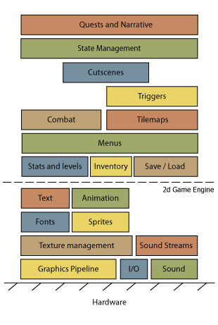

# Unity

**I'm still learning Unity**, so this is only made by a beginner for beginners. Unity is a **game engine** that you can [download here](https://store.unity.com/#plans-individual).

* **unity hub**: software to manage unity versions and projects
* **unity**: downloaded through unity hub, **usually peoples are using LTS** <small>(Long-term support)</small> **versions** of unity because they will still receive patches (fix bugs, no new features) for 2 years, **so they are stable versions**.

You may use the student plan (if you are a student)

* go to [Unity Student Plan](https://unity.com/products/unity-student)
* click on High school students
* Log in/Register
* Fill the form, powered by SheerID
* Send a pic of your student ID
* Done, wait a bit, you should receive a mail telling you **welcome** and **how to get started**

## What's a Game engine?

I found this picture a while back on [envato-tuts+](https://gamedevelopment.tutsplus.com/). This is quite easy to understand that a **game engine** will deal for you about a lot of things related to the tech/hardware <small>(sound, io, graphics)</small> and let you focus on your game <small>(quests, inventory, levels, ...)</small>.

Unity is focused on providing support for multiples platforms <small>(Windows, Linux, Mac, Web, Android, iOS)</small>, so it's quite convenient.

The editor is written in **C++**, but the scripts (=your code) will be in **C#**.

Unity is providing generic support for your games, sometimes you may want more. You can add **plugins** for that. For instance, the [TopDownEngine](https://assetstore.unity.com/packages/templates/systems/topdown-engine-89636) (a **paid** asset) is providing a lot of help to create 2D/3D TopDownGames <small>(check "templates" on the unity store to see what you could expect from game templates, as you may save a lot of time with them)</small>.

